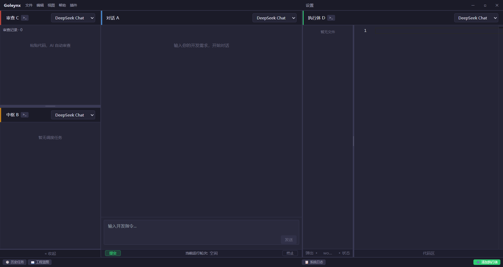
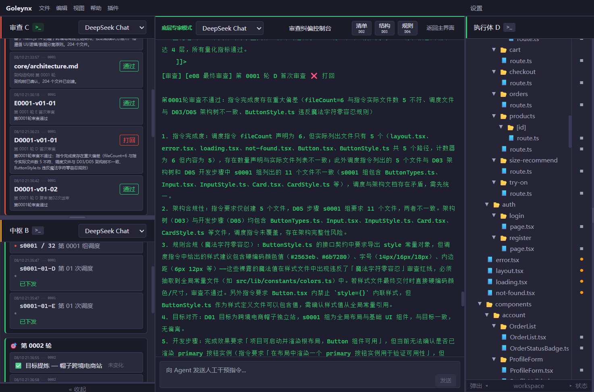
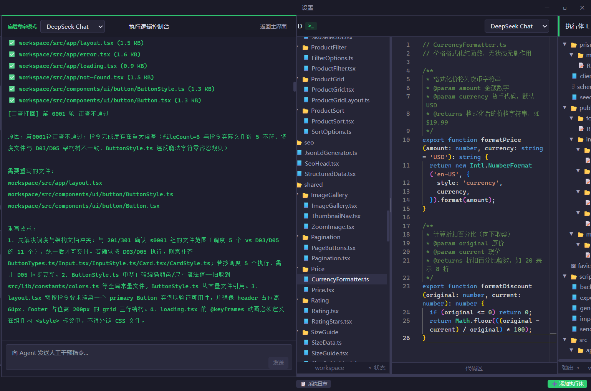
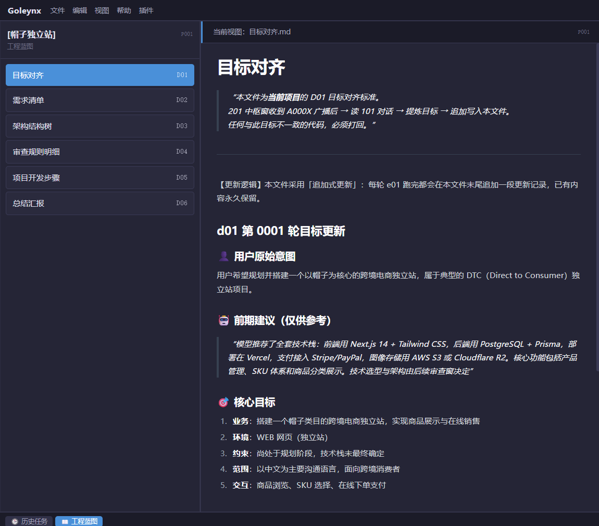

<div align="center">

<h1 align="center">🌌 GOLEYNX</h1>

<p align="center">  
    
</p>

<p align="center"><strong>探索下一代 AI 协作方式的多智能体协同系统</strong></p>

<p align="center">GOLEYNX-CORE 是当前开源阶段的 AI 协作运行环境。通过人为编排的角色体系、Beacon 广播通信机制和配置化引擎，让多个 AI 模型与工具协同完成复杂任务，并记录完整的协作轨迹。</p>

<p align="center">这些协作轨迹用于探索未来 GOLEYNX-AI 的核心目标：训练能够自主组织多个智能体完成任务的 Leader 模型。</p>

<p align="center">  
    
    
    
</p>

<p align="center">  
  <a href="#vision">愿景</a> ·  
  <a href="#core-now">CORE</a> ·  
  <a href="#beacon">Beacon</a> ·  
  <a href="#quickstart">快速开始</a> ·  
  <a href="core/Goleynx%20多智能体协同·广播事件设计说明.xlsx">设计说明</a> ·  
  <a href="examples/sample-log.txt">示例日志</a>  
</p>

<p align="center"><strong>当前 CORE 负责产生 AI 协作过程数据；未来 GOLEYNX-AI 将探索让 Leader 模型自主规划任务、组织智能体并调度模型资源。</strong></p>

</div>

---

> **⚠️ 写在前面**  
> 这不是一个已经实现的“AGI 终态产品”，也不是一个普通的自动写代码脚本。GOLEYNX CORE 是一个基于广播信标（Beacon）的多智能体协同编排沙盒——我们在这里跑通 AI 之间的通信、调度与纠错，并收集系统运转数据。

<a id="vision"></a>

## 🌠 我们到底想干什么

当前的大语言模型已经具备理解、推理和生成能力，但完成复杂任务时，仍然依赖人类提前设计：谁负责规划、谁负责执行、谁负责检查、谁负责协调、流程如何推进。

也就是说：

```
现在的 AI：

人设计组织方式
        ↓
模型执行组织方式
```

GOLEYNX CORE 探索另一条路径：

```
模型学习组织方式
        ↓
模型尝试自己组织起协作结构
        ↓
模型自主决定如何完成复杂任务
```

一句话：**我们要训练一个会自己组织协作的 Leader 模型。**

这个模型将理解一整套协作语法——信标怎么编码、引擎怎么触发、蓝图怎么持久、审查怎么收敛、轮次怎么推进——然后自己决定：开几个进程、每个进程扮演什么角色、各挂什么模型、进程之间怎么协调。

而你现在看到的这个仓库，不是那个 Leader。它是生产训练数据的沙盒：通过固定窗口、固定引擎，一遍遍地跑真实任务，产生大量协作轨迹，为训练 Leader 提供燃料。

演化路线：

```
人为编排（人配模型、引擎定流程）
        ↓
产生大量协作轨迹
        ↓
用这些轨迹训练 Leader 模型理解协作协议
        ↓
Leader 内化 Beacon 语言
        ↓
Leader 自主决定开几个进程、各挂什么模型、怎么协作（自主编排）
        ↓
模型自主组织解决复杂问题
```

---

<a id="core-now"></a>

## 🛠️ CORE 现在是什么

GOLEYNX CORE 是一个可以运行的 AI 协作环境。它通过模拟一个完整的智能协作组织，让模型在真实任务中产生协作轨迹。

当前版本采用固定的四角色协作结构：

```
A 窗口   需求理解与目标入口

   ↓

B 窗口   任务拆解与协作调度

   ↓

C 窗口   独立审查与质量控制

   ↓

D 窗口   执行任务与产出结果
```

四个窗口通过 **Beacon 信标协议** 进行通信。它们不直接调用彼此，而是通过统一的事件广播机制协作。




> 模型不绑定任何厂商。你在设置里填谁的 API Key，它就调谁。DeepSeek、OpenAI、本地模型……都行，四个窗口还可以各自用不同的模型。

---

<a id="beacon"></a>

## 📡 Beacon：智能协作语言

CORE 的核心不是窗口。核心是 **Beacon 信标协议**。

Beacon 定义了智能单元之间如何表达：状态、意图、任务、调度、反馈、审查结果。例如一条 `B0001-s0001-01-D` 的信标，就表示“第 1 轮、第 1 步、第 1 版、发给 D 执行窗口”的调度指令。

> 完整的信标编码规则，见仓库内的设计说明：
>
> - [📊 Goleynx 多智能体协同·广播事件设计说明.xlsx](core/Goleynx%20多智能体协同·广播事件设计说明.xlsx)
> - [📝 Goleynx-Beacon-For-AI.md](core/Goleynx-Beacon-For-AI.md)
> - [📝 Goleynx-Beacon-For-AI-zh.md](core/Goleynx-Beacon-For-AI-zh.md)

现在，Beacon 被不同窗口之间使用。未来，Beacon 可能成为模型内部进程之间组织认知过程的一种语言。



Beacon 的特点：事件驱动、状态明确、可追踪、可复现。

---

## 🏗️ 当前架构

### 1. Beacon 信标系统

负责智能单元之间的结构化通信。事件驱动、状态明确、可追踪、可复现。

### 2. 声明式引擎系统

协作流程不是写死在代码中，而是通过声明式引擎定义。可以动态加载、修改协作方式、扩展新的智能角色。

### 3. 蓝图记忆系统

长任务最大的挑战是长期记忆。CORE 使用结构化蓝图保存：目标、需求、架构、审查规则、执行计划、总结结果。

### 4. 审查与反馈循环

执行和评价分离。一个结果不能因为生成出来就代表正确。它必须经过：

```
执行 → 审查 → 反馈 → 修正 → 再次验证
```

形成闭环。

> 配套机制：**轮次常量**（全局 4 位时间刻度，所有动作携带）与**非对称断代**（用户入口提前断代、后端延后断代，隔离跨轮上下文污染）。

---

## 🔍 为什么固定窗口

这是 CORE 最容易被误解的地方。

很多人看到 A/B/C/D 四个窗口，会认为“这是一个固定的多 Agent 系统”。但实际上：

**固定窗口不是最终目标，而是训练环境。**

CORE 本身是一个编排器：它按照信标广播、轮次推进、步进拆解，一轮一轮把任务在各窗口之间组织起来。当前这一步是**人为编排**——人在设置里配模型、引擎 JSON 定流程，系统照着走。我们想训练的，正是把“编排”也交给模型自己。

我们需要先创造一个稳定、可观察、可重复的智能组织。通过大量运行——任务拆解过程、角色协作过程、信标通信过程、审查纠错过程、最终完成过程——产生完整的协作轨迹。

这些轨迹包含决策过程、任务分配、角色转换、错误修正、成功路径。它们是我们训练 Leader 模型所需的原材料。这条路的前面还很硬，方法也远未定型，但数据生产这件事本身今天就能跑通。

---

## 🔀 从窗口到进程：训练完成后的自主编排

你在 CORE 里看到的是 A、B、C、D、E、F 六个窗口。它们不是写死的功能模块——每个窗口都可以绑定不同的模型。你在设置里添加哪些模型的 API，窗口就能用哪些。今天我们只接了 DeepSeek，所以六个窗口都在用 DeepSeek；明天接上 OpenAI、Claude，就可以让 A 用 DeepSeek、B 用 OpenAI、C 用 Claude——谁用什么模型，现在是人决定的。

CORE 之所以能跑，是因为它是一个编排器：按信标广播、轮次推进、步进拆解，一轮一轮把任务在各窗口间组织起来。这一步是**人为编排**——人配模型、引擎定流程，系统照着走。

我们想训练的，是省掉“人做编排”的环节。

训练出来的那个模型，扮演的就是现在 **101 对话窗口（A 窗口）的角色——我们叫它 Leader**。它接到你的任务，知道你在设置里挂了哪几个模型的 API，于是自己决定：

- 开几个**进程**，每个进程承担一个角色（类似今天的 B 调度、C 审查、D 执行……）；
- 每个进程用哪个模型——也是 Leader 定，它可以让写代码的进程用 DeepSeek、审逻辑的进程用 Claude；
- 进程之间怎么通信、怎么协调、共享状态放哪——也就是把信标语法、轮次推进、蓝图持久这套机制，在内部重新“组织开会”定下来。

对模型外部的人来说，你只是对一个 Leader 说话；对模型内部来说，它拉起了一组进程，各自扮演不同角色、可能挂着不同模型，靠信标语法彼此广播、把共享状态写进蓝图。

我们暂且叫这些内部角色为“进程”：它们彼此独立、各自保有上下文、靠消息（信标）通信，而不是共享内存的线程。具体是开系统进程、还是并行上下文、还是对每个子任务另发一次 API 调用，机制待定；但“独立 + 消息通信 + 可各挂模型”这个形态是清楚的。

---

## 🎬 一个例子：动画制作

上面说“窗口会消失、变成进程”，听起来很抽象。用动画制作这个非软件领域的例子，看训练完成后的模型内部到底发生什么。

用户说：*“做一个 2D 武侠动漫，主角是盲剑客，3 分钟，水墨画风。”*

这不是写代码，是动画制作。但模型内部发生的事：

**第 1 轮：** 模型（Leader）内部分叉出 6 个进程——

- 导演进程：拆解为分镜脚本（开篇 / 冲突 / 高潮 / 收尾）
- 分镜进程：为每个镜头定义画面元素 → 提交导演审查
- 角色设计进程：产出盲剑客 / 反派 / 配角 → 送审 → 修正 → 通过
- 场景进程：产出竹林 / 祠堂 / 雨巷 → 送审 → 通过
- 动画进程：逐帧生成 → 送审 → 通过
- 审查进程：独立审查所有产出，全通过后收敛 → 进入下一轮

**第 2 轮：** 用户说 *“主角改成女性，武器从剑换成箫。”*  
系统捕获新意图 → 对比上一轮目标 → 判定目标已变化 → 重建需求与步骤、调度执行 → 审查进程检查历史产出是否与新目标一致，不一致则追溯修正。

**第 3 轮：** 用户说 *“可以了，收尾。”*  
系统判定目标未变化 → 跳过重建 → 直接继续未完成的步骤。

整个过程，人只负责说话。分工、协作、审查、迭代、收敛，全部由模型内部进程靠信标语法自主完成——用的还是 `core/` 里那套规则（信标、引擎、蓝图、审查熔断），只是产出从代码变成了动画。**规则不限领域。**

---

## 🔬 另一个例子：跨学科科研调研

动画例子说明“换领域”，这个例子的重点在**真并发调度**——多个专业视角同时工作，这是单体模型串行回答做不到的。

用户说：*“评估钙钛矿太阳能电池的产业化可行性。”*

模型（Leader）并发分叉出一组进程，各自挂不同模型、同时推进：

- 文献进程：搜集论文与专利，归纳研究进展
- 材料进程：分析稳定性、毒性与寿命瓶颈
- 工艺进程：梳理量产工艺路线与良率难点
- 市场进程：调查成本结构与政策环境
- 审查进程：交叉验证四个进程的结论是否互相矛盾，不一致就打回重做

五路并发，Leader 收口汇总成一份报告。物理、化学、工程、市场四个视角在同一轮里并行协作——这正是“窗口 = 协作角色”在复杂任务上的价值：**不是更快，而是更全。**

---

## 🌐 跨场景应用

引擎不绑定领域。把 `e01`–`e03`、`e05`–`e10` 的 `system_prompt` 换成对应领域的指令，同一套引擎可以驱动完全不同的工作：

| 场景       | 窗口角色示例                       | 说明                                |
| -------- | ---------------------------- | --------------------------------- |
| **动画制作** | A=导演 B=分镜师 C=审核 D=动画师        | 用户描述剧情 → 拆解分镜 → 生成动画段落 → 审查 → 输出  |
| **合同审查** | A=客户 B=法务总监 C=合规审查 D=条款撰写    | 上传合同 → 目标对齐 → 拆解条款 → 审查 → 修正 → 输出 |
| **课程设计** | A=需求方 B=教学总监 C=质量审核 D=内容编写   | 描述教学目标 → 拆解大纲 → 撰写内容 → 审查 → 输出课件  |
| **数据分析** | A=分析师 B=数据总监 C=交叉验证 D=SQL/图表 | 描述分析目标 → 拆解指标 → 写查询 → 验证 → 输出报告   |
| **软件开发** | A=产品 B=架构师 C=代码审查 D=开发者      | 描述需求 → 拆解架构 → 写代码 → 审查 → 输出项目     |

这些场景不是临时想出来的，它们在 `core/` 的广播事件设计说明中已经按窗口角色和流程被明确定义。窗口 A/B/C/D 不是为某个领域设计的，它们是四种**协作角色**——入口、调度、审查、执行——在任何需要多人协作的领域都能复用。

---

## ✅ 当前能做什么

CORE 当前就能跑起来用，能够完成软件开发、内容生产、数据分析、文档审查、多阶段复杂工作流。

以软件开发为例，你给一句开发需求，A/B/C/D 四个窗口按引擎自动跑：

1. **中枢（B）** 拆解任务、生成蓝图
2. **执行（D）** 按工单写代码、改文件
3. **审查（C）** 拿规则独立检查交付物
4. 不通过就**打回**，执行体重写；最多熔断 6 次
5. 全部通过后**收敛**，进入下一轮，直到需求完成



整个过程可追溯：每一步发了什么信标、跑了什么引擎、谁审的、为什么打回，全部留在轨迹里。

---

## 🗺️ 蓝图持久化

长任务最大的敌人是遗忘。Goleynx 用 6 份核心文件（D01~D06）把项目状态固化到本地，轮次之间靠它们传递上下文：

- **D01 目标对齐**：用户意图、核心目标
- **D02 需求清单**：拆出来的需求条目
- **D03 架构结构树**：项目结构
- **D04 审查规则明细**：审查者依据的规则
- **D05 项目开发步骤**：推进步骤
- **D06 总结汇报**：每轮结论



AI 忘了全局，就加载这些文件立刻懂。这就是为什么它能在几十轮之后还知道自己在干什么。

---

## 👤 用户怎么参与

用户不只是开头说一句话。运行过程中，用户可以随时给反馈，而且**给任何窗口都可以**——A、B、C、D、E、F，每一个窗口都能对话、都能被干预。

### 对话被怎么记录

用户在哪个窗口说话，哪个窗口就留下本地记录，格式一致：

- `B0001-U01`：第 1 轮，用户在 B 窗口的第 1 句输入（U = User）
- `B0001-M01`：第 1 轮，B 窗口里模型对这句话的回复（M = Model）

换到 D 窗口就是 `D0001-U01 / M01`，换到 C 窗口就是 `C0001-U01 / M01`……多轮对话按顺序累加，全部存本地，可回看、可追溯。

### 一个干预的例子（以 B 调度窗口为例）

下面用 B 窗口说明“干预”长什么样。**同样的干预逻辑，在 D、E、F、C 窗口也一样成立**，只是改变的对象不同。

正常调度：第 1 轮第 1 步（`S0001`）有 15 个文件，系统原计划把 7 个派给 D 窗口、8 个派给 E 窗口：

- `B0001-S0001-01-D`：派 D 窗口写 7 个文件
- `B0001-S0001-01-E`：派 E 窗口写 8 个文件

用户在 B 窗口看了觉得不对，说：“这 15 个里，有 10 个属于同一套逻辑，应该都给 D 窗口一口气写完；剩下 5 个给 E 窗口。按 7/8 拆，逻辑是断的。”

这句话被记成 `B0001-U01`，模型回复 `B0001-M01` 确认。系统据此**重新下发调度**，版本号从 01 变成 02：

- `B0001-S0001-02-D`：现在派 D 窗口写 10 个文件
- `B0001-S0001-02-E`：派 E 窗口写 5 个文件

版本号递增，根源是**用户对调度的重新分配**，不是审查打回。

### 版本号 ≠ 审查驳回

版本号 `01 → 02` 递增，是“同一轮同一步，调度被重新下发”。它和审查驳回是两件事：

- **版本递增**：用户在任意窗口干预、改了分发方案 → 重新下发工单。
- **审查驳回**：C 窗口（审查者）发现 D/E 写出的东西不合格，发另一条信标打回重做。那是质量回路，不是调度回路。

两者都会让某一步重新跑，但触发者和含义不同，信标也不同。

### 目标对齐

每一轮对话被目标对齐机制捕获。**目标变了**就重建全部并追溯修正历史产出；**目标没变**就直通继续。所有对话资产（包括各窗口的 `W0001-U01 / M01` 干预记录）持久化在蓝图文件中，对抗上下文遗忘。

### 训练完成之后，用户怎么参与

以上是 CORE 当前的行为：用户在任何窗口插话，改变的是这一轮的运行。

当模型训练完成、协作语法内化之后，用户参与的方式换一个层面：

模型内部有多个进程，其中**总有一个 Leader 进程**。用户对 Leader 直接下命令，Leader 就把这条命令拆开，分派给各个进程去执行——外部看是“你对一个模型说话”，内部是 Leader 在组织一支进程团队行动。

也就是说，无论现在是固定窗口、还是未来自主进程，**用户随时参与、随时纠正**这件事本身不变；变的是参与所作用的对象——从“某个窗口的调度”，变成了“Leader 对进程的编排”。

---

## 📊 训练数据从哪里来

仓库里 `examples/sample-log.txt` 是一次真实运行的系统日志。它长这样：轮次初始化、信标广播（如 `B0001-s0001-01-D`）、引擎一步步执行、调度时由大模型决定把文件分给哪些窗口、一次性并发唤醒多个执行体窗口、审查不通过打回……每一步谁发了什么、跑了什么、谁审的、为什么打回，全在里面。

这就是一条“协作轨迹”。

我们的计划是：让这套软件在大量不同领域的任务上反复运行——写网站、做动画、审合同、做调研……积累海量这样的日志，再用它们去训练那个掌握语法的 Leader 模型。

这个 Leader 我们还没训出来，那是前面最硬的仗。但沙盒今天就能跑，数据今天就能产。我们把它敞开，让认同这个方法的人都能复现、扩展、积累自己的燃料。

---

## 📦 仓库里有什么

- 能跑的 **Electron + React** 软件（事件驱动 + 声明式引擎的 AI 编排）
- `core/` 权威文档：
  - [📊 Goleynx 多智能体协同·广播事件设计说明.xlsx](core/Goleynx%20多智能体协同·广播事件设计说明.xlsx)（广播事件设计总说明）
  - [📝 Goleynx-Beacon-For-AI.md](core/Goleynx-Beacon-For-AI.md)（信标编码体系总览）
  - [📝 Goleynx-Beacon-For-AI-zh.md](core/Goleynx-Beacon-For-AI-zh.md)（信标编码体系中文总览）
- **9 个声明式引擎 JSON**（`e01`–`e03`、`e05`–`e10`，`e04` 按设计故意空缺）
- 示例蓝图与运行日志（`examples/`）——其中 `examples/sample-log.txt` 是一次真实运行的轨迹样本，也是训练 Leader 的原始数据形态

---

<a id="quickstart"></a>

## 🚀 快速开始

环境要求：

- Node.js（见 `package.json` 的 `engines`）
- 包管理器 `pnpm`

```bash
# 1. 安装依赖
pnpm install

# 2. 启动开发模式
pnpm dev

# 3. 在设置里填入你的模型 API Key
#    四个窗口可以各自绑定不同的模型

# 4. 在对话窗（A）输入一句需求，开始第一轮
```

打包桌面可执行文件：

```bash
pnpm build        # 构建
pnpm build:win    # 打包 Windows 安装包（需要本机有对应运行环境）
```

---

## 🤝 为什么开源

GOLEYNX CORE 开源，是因为这套沙盒和信标协议已经成熟、可运行，而“用确定的信标去约束不确定的 AI”这一方法本身有价值。

无论你是开发者、研究团队还是 AI 实验室，只要认同“模型可以自己组织协作”这个方向，都可以把它当作数据生产机，积累你自己的协同数据，训练你自己的模型。

终点在哪，我们也在走；这条路我们一起看。

---

## 🧩 参与

- **跑起来**：用你自己的需求跑几轮，体验多智能体协作
- **换领域**：把引擎的 `system_prompt` 换成你领域的指令，让同一套流程驱动动画、合同、课程、数据分析
- **改引擎**：在 `core/engines/` 里写自己的声明式引擎 JSON，丢进去自动注册
- **补审查规则**：完善蓝图里的审查规则明细，让审查更准
- **贡献轨迹**：你跑出来的协作轨迹，是训练“会协作的模型”的燃料。训练 Leader 是整条路线里最硬的部分之一，我们把数据生产过程敞开，让更多人来积累、验证。

---

## 📮 沟通与反馈

GOLEYNX CORE 还很早期。最有价值的反馈来自真实的多智能体协作场景：哪里好用、哪里别扭、哪些协同过程没被记录清楚。

- **邮箱**：<lucas@chuanis.com>
- **微信**：goleynx（添加时备注 GOLEYNX）
- **Twitter / X**：[@goleynx](https://twitter.com/goleynx)

## 📄 License

见仓库根目录 [LICENSE](LICENSE) 文件。

